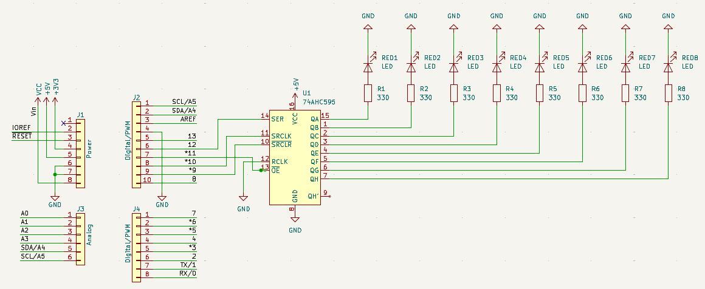

# Overview
This example looks at taking a serial signal and outputting a parallel signal (SIPO) to light up multiple LEDs with fewer pins from the MCU.
The SIPO shift register that this example uses is the 8-bit [SN74HC595](https://www.ti.com/product/SN74HC595). The exmample implements a counter that displays the value in binary every 50 milliseconds.
The speed of the counter can be modified by editing the SHIFT_TIME_MS definition.

## Build
The setup is more complicated compared to previous examples so refer to the schematic below for pin connections. Be sure to edit the command according to your environment.
```CMD
build.bat -tar shift -port COM5 -avr C:\avr-toolchain\avr8-gnu-toolchain-win32_x86_64\
```


